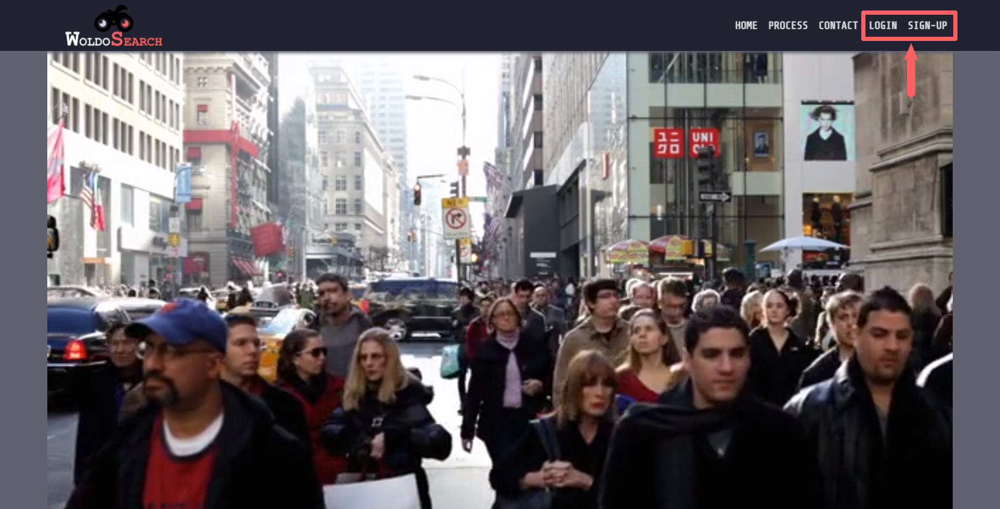
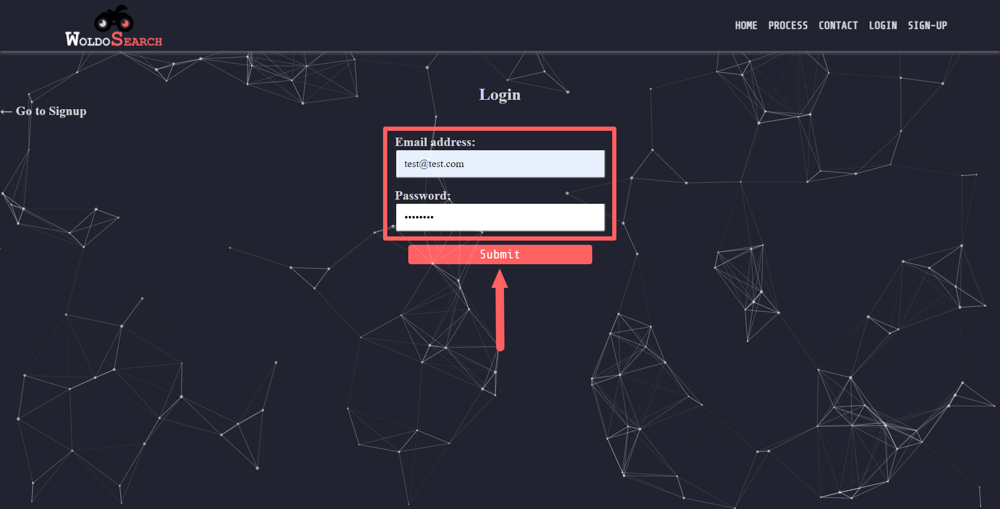
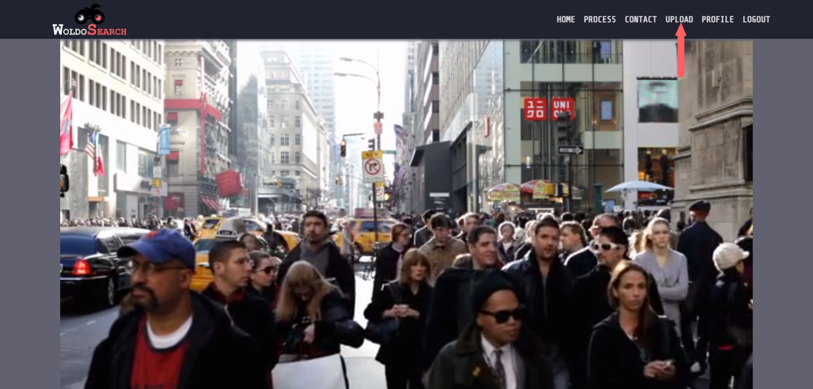
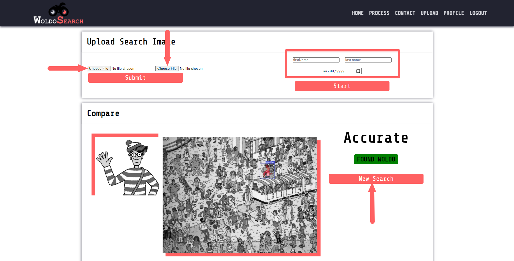
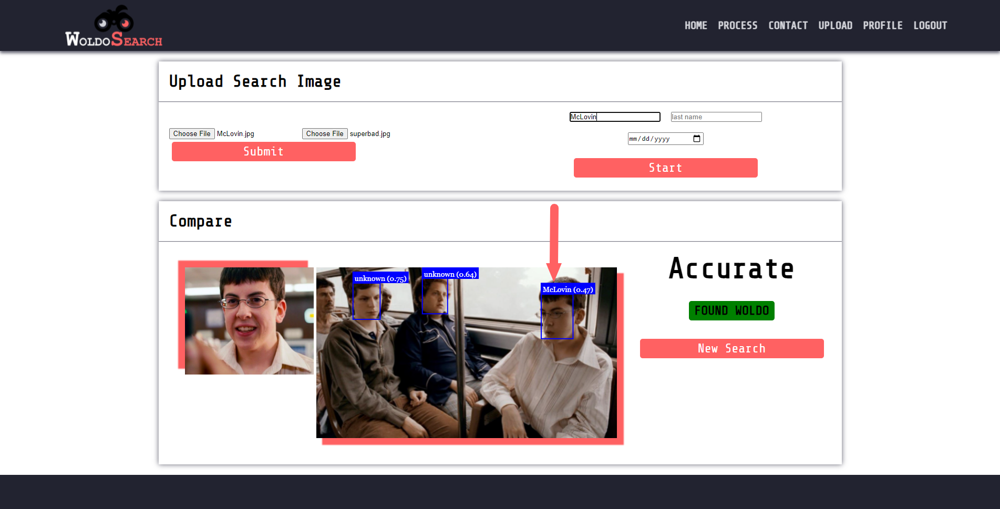

# Id-Authenticator

## Description
This is a face detection application that uses FaceAPI.js and TensorFlow.js. It was created using the full MERN Stack. The application can be found in [Heroku](https://limitless-lowlands-03171.herokuapp.com/) but can also be cloned and run locally, see [Installation](#installation) and [Usage](#usage) for more details. Woldo Search was created so user’s can upload reference images and compare them to a search image using visual recognition. The intent was to allow users to verify and find the the person they are looking for in a busy images. This was accomplished by utilizing, FaceAPI.js, NPM packages and specific Models.

## Table of Contents
- [Installation](#installation)
- [Usage](#usage)
- [Contributing](#contributing)
- [Questions](#questions)
- [License](##license)

## Demo

## Installation

How to install this application and getting started:

* Clone the repo to your local machine
* Open the integrated terminal from the root folder
* Run `npm install` which will install any dependencies an all three package.json files
* Run `npm run develop` which will use Concurrently to cd into the server folder and cd into the client folder and run npm start
* React will run on http://localhost:3000/ and the server GraphQL at http://localhost:3001/graphql

## Usage
You can find the deployed application by clicking on this link https://limitless-lowlands-03171.herokuapp.com/.

### Step 1
> **Note**: Not all available options and steps will be demonstrated here
* After the command has been invoked or if you visit the Heroku App you will see the landing page

* Click on the `Login/Sign Up` button on the upper right hand corner

### Step 2
* Click on the `Upload` navigation tab that will show up after signing in
* You will have the image upload component of React load

### Step 3
* Start by uploading the "Reference Image" on the left
* The "Search Image" should be uploaded on the right
* Enter the Name and DOB for the person being search and to save to your search history

* Click `New Search` to run the Face Detection API
* After a second or two you will see a blue box show around the faces searched
* If the API finds a match it will assign the Name Entered on the form

> **Note**: Not all applications options are demonstrated or depicted here

## Contributing
There are many ways in which you can participate in this project, for example:

* Submit bugs and feature requests
* Review source code changes
* Review the documentation and make pull requests for anything from typos to additional and new content

## Questions
To find more information and the repository on this project please visit [GitHub](https://github.com/Krcano/Id-Authenticator.git).

For any additional questions please email:

[Alejandro Nunez](mailto:alexnunez957@gmail.com)

[Israel Rios](mailto:israelm.riosjr@gmail.com)

[John des Garennes](mailto:johndesgarennes@gmail.com)

[Kelly Cano](mailto:krcano2001@gmail.com)

## License
Copyright (c) 2022
Licensed under the [MIT License](LICENSE).